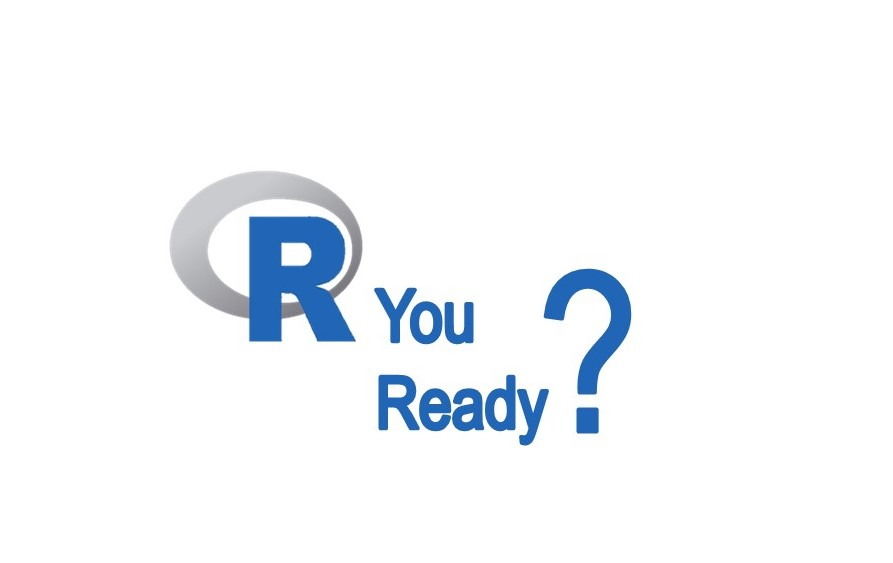
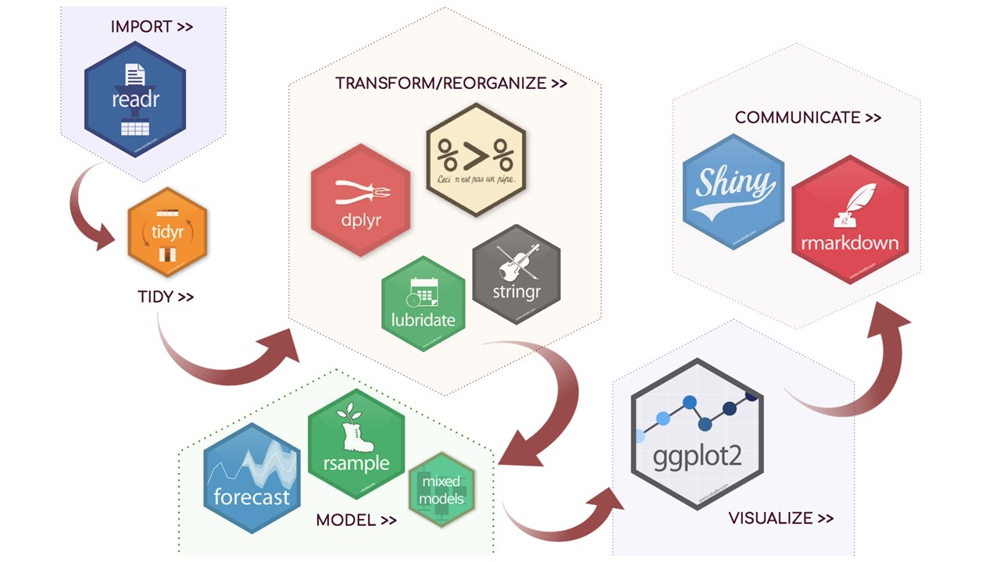
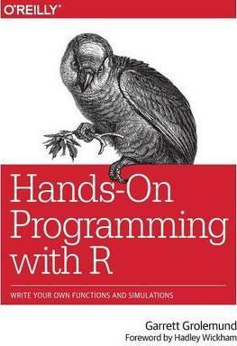
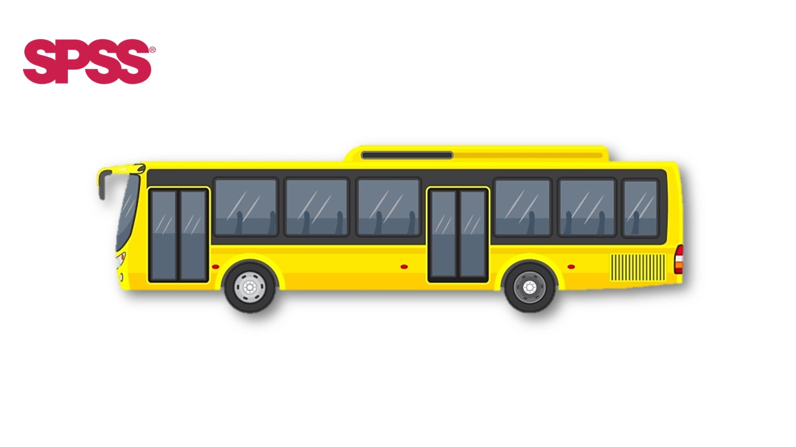
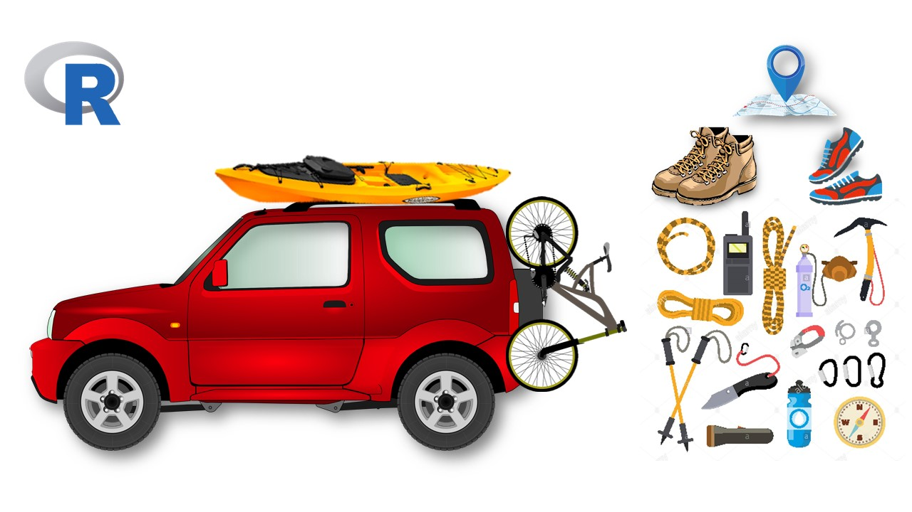
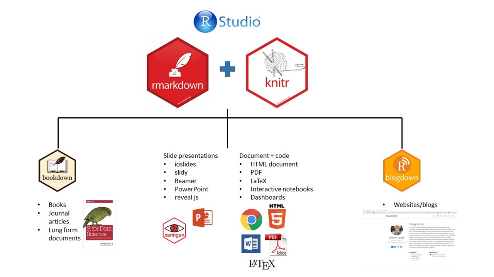
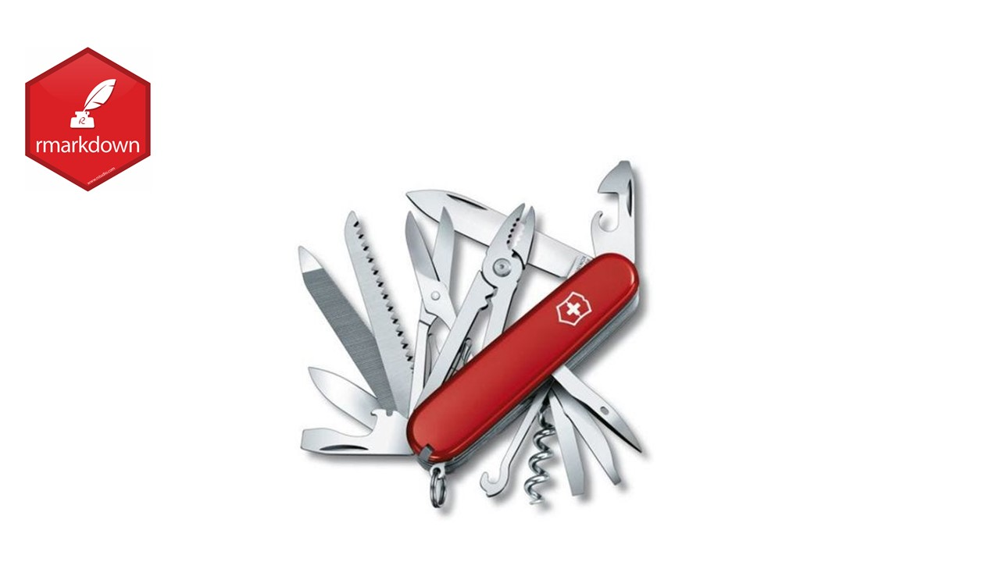
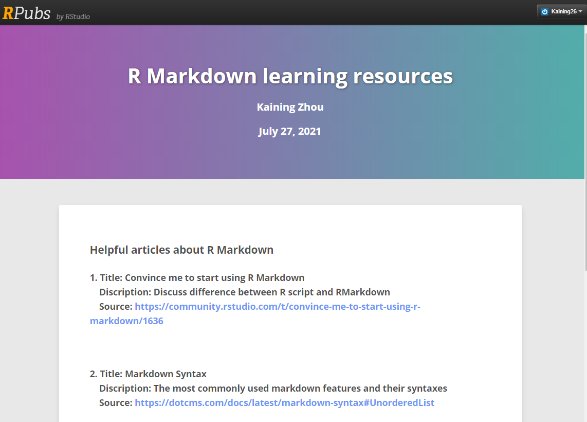

---
output:
  xaringan::moon_reader:
    seal: false
    nature:
      ratio: "16:9"
---

class: center

### My first R Markdown presentation
.large[Kaining Zhou| Ben-Gurion University, Israel | 28/07/2021]

---
class: center, middle
### For a long time, I have stuck with Excel and JMP for data analysis.  
### One day my collegue showed me elegent graphs he made using R, and nice reports he published on RPubs.

---
class: center, middle
.pull-top[{width=50%}

]
.pull-bottom[
### I was amazed at R's seamless working style
]

---
class: center, middle

.pull-top[{width=50%}

]
.pull-bottom[
### At the same time, I felt like a primitive person from the Stone Age compare with other collegues who mastering adavnced scientific tools
]

---
class: middle center

# It's  time to change

---
.pull-left[

]
.pull-right[
#### In the preface of book, Hands-On Programming with R, it is mentioned that:  
*'Busses are very easy to use, you just need to know which bus to get on, where to get on, and where to get off (and you need to pay your fare). Cars, on the other hand, require much more work: you need to have some type of map or directions (even if the map is in your head), you need to put gas in every now and then, you need to know the rules of the road (have some type of drivers license). The big advantage of the car is that it can take you a bunch of places that the bus does not go and it is quicker for some trips that would require transferring between busses*
...

]

---
.pull-left[

]
.pull-right[
...
####   
*Using this analogy, programs like SPSS are busses, easy to use for the standard things, but very frustrating if you want to do something that is not already pre-programmed. R is a 4-wheel drive SUV (though environmentally friendly) with a bike on the back, a kayak on top, good walking and running shoes in the passenger seat, and mountain climbing and spelunking gear in the back. R can take you anywhere you want to go if you take time to learn how to use the equipment, but that is going to take longer than learning where the bus stops are in SPSS.'*
]

---
class: center

{width=50%}
---
class: center

{width=50%}

---
class: center

{width=50%}
### R Markdown is specially versatble, can be used for reports, notes, presentations, blog posts... 

---
class: center

{width=50%}

### R Markdown is as versatble as a swiss army knife

---
class: center

{width=30%}

#### My first trail with R Markdown was making report which later published on RPubs 

---
class: middle, center

{width=30%}

### This presentation is my first trail with Xaringan

